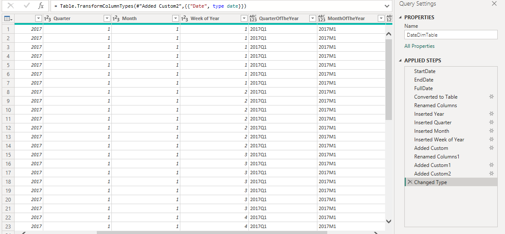

# SALES-RETAIL-DASHBOARD
Documentation of Sales Retail Dataset analyses with Power BI

# Introduction
After a break from data analytics due to school workload, I'm back with another project to get myself back on track. I explored a Sales Retail dataset to extract actionable insights for stakeholders. I was excited to work on this project as it requires both Business Intelligence and Financial Analysis skills (Statement of Profit and Loss) which I have a background in.

## Business Task
1. To identify the top-selling products and categories
2. To identify the most profitable stores and departments.
3. To identify the factors that affect sales revenue.
4. To analyze the trend of sales target and actual sales over time.
5. To analyze gross margin by product, category, or store.

## Data Extraction
The dataset folder is made up of 4 files:
1. Department List (.xlsx)
2. Retail Fixed Costs (.xlsx)
3. Sales Retail 2017-2019 (.csv)
4. Store Details (.csv)

## Data Transformation (in Power Query)
I performed some basic and advanced transformations on Power Query which include:
- Filling missing row headers down
- Transforming blanks to nulls in the Metric column
- Filling down values in the Metric column
- Pivoting and unpivoting columns
- Creating a parameter to hold the file path for easy accessibility

### Creating Date Dimension Table
It's pertinent to create a separate table for date to ensure efficient Time Intelligence analyses and exploration.
- Week of the year
- Month of the year
- Quarter of the year
- Month
- Quarter
- Week

## Loading Data to Power Query and Data Modelling
After performing the necessary data transformations, I loaded the data into Power BI for further analysis. I also created relationships between the tables to enable data modeling.

## Creating Profit and Loss Statement in Power BI
A profit and loss statement, also known as an income statement, is a financial report that provides an overview of a company's revenues, expenses, and net income (or loss) over a specific period of time. The purpose of a profit and loss statement is to show whether a company has made a profit or loss during that period.

### Elements of the Profit and Loss Statement
- Sales = SUM(SalesFactTable[Sales])
- COGS = [Sales.]-[GM]
- Gross Margin = SUMX(SalesFactTable,[Sales]*[Margin])
- Gross Margin% = [GM]/[Sales.]
- SumWages = CALCULATE(SUM(CostandTarget[Wages]),FILTER(Storedetaials,Storedetaials[StoreID]<>99))
- SumRent = CALCULATE(SUM(CostandTarget[Rent]),FILTER(Storedetaials,Storedetaials[StoreID]<>99)) 
- EBIT = [GM] - ([SumRent]+[SumWages]+[OtherCost]) 
- EBIT% = [EBIT]/[Sales.]

## To Measure Business Growth
- Sales PY = CALCULATE([Sales.],SAMEPERIODLASTYEAR(DateDimTable[Date])) 
- YoY Sales Growth = SalesFactTable[Sales.] - [Sales PY] 
- Sales YoY Growth % = ([Sales.]/[Sales PY])-1 
- EBIT% YoY = [EBIT%] - CALCULATE([EBIT%],SAMEPERIODLASTYEAR(DateDimTable[Date]))

## DASHBOARD - KPI AND PROFIT AND LOSS PAGE 

## DASHBOARD - STORE DETAILS PAGE

## DASHBOARD - TOP AND BOTTOM SELLERS PAGE

